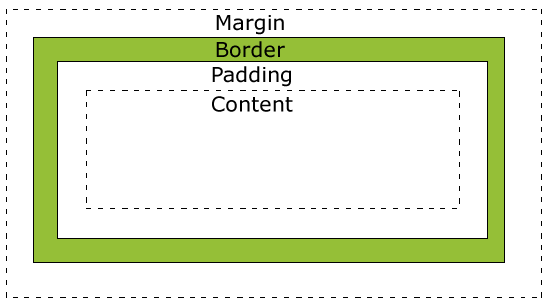

<!--
 * @Author: Bean
 * @LastEditors: Bean
 * @Date: 2020-07-03 10:19:38
 * @LastEditTime: 2020-07-06 10:44:46
 * @Description: file content
 * @FilePath: /StudyNotes/Users/caoyong/Documents/github/InterviewRecord/CSS/css3盒模型.md
--> 
# CSS3 盒模型

> css盒模型：css盒模型本质上是一个盒子，封装周围HTML元素，它包括：边距（margin外边距，padding那边距）、边框（border）、填充和实际内容（content，也就是盒模型中的子盒模型）；

  
  
盒模型

